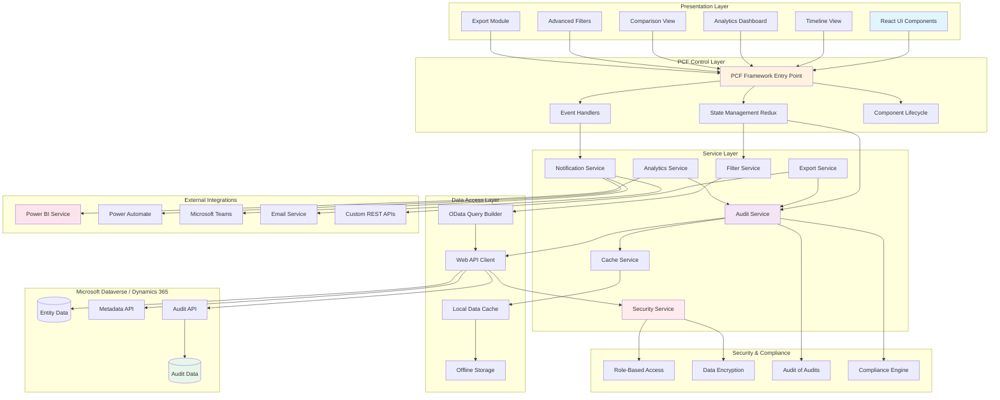

# Advanced Audit History Control PCF

[](LICENSE)
[](https://docs.microsoft.com/powerapps/developer/component-framework/overview)
[](https://github.com/yourusername/advanced-audit-history)

> **Enterprise-grade PCF control for comprehensive audit history management in Dynamics 365 and Power Platform. Features analytics dashboards, compliance reporting, timeline visualization, bulk restore, real-time alerts, and Power BI/Power Automate integration for advanced governance.**

## 🎯 Overview

The **Advanced Audit History Control** is an enterprise-grade PowerApps Component Framework (PCF) control that extends the capabilities of standard audit history tracking in Dynamics 365 and Power Platform. Built upon the foundation of the [original audit history control](https://github.com/novalogica/pcf-audit-history), this advanced version introduces powerful features for comprehensive audit management, analytics, and compliance reporting.

This control is designed for organizations that require sophisticated audit tracking capabilities, detailed compliance reporting, and advanced data governance features.


---

## 🏗️ Architecture

The Advanced Audit History Control follows a layered architecture pattern, ensuring separation of concerns, maintainability, and scalability.



### Layer Descriptions

**Presentation Layer**
- React-based UI components providing rich, interactive user experience
- Modular view components (Timeline, Analytics, Comparison, Filters, Export)
- Responsive design supporting desktop, tablet, and mobile devices

**PCF Control Layer**
- Entry point for PowerApps Component Framework integration
- State management using Redux for predictable data flow
- Event handling for user interactions and system events
- Manages component lifecycle (init, updateView, destroy)

**Service Layer**
- Business logic encapsulation in specialized services
- Audit Service: Core audit retrieval and processing logic
- Export Service: Multi-format export functionality (Excel, PDF, CSV)
- Notification Service: Real-time alerts via Teams, Email, and in-app
- Analytics Service: Data aggregation and statistical analysis
- Filter Service: Advanced filtering and query construction
- Cache Service: Performance optimization through intelligent caching
- Security Service: Authentication, authorization, and encryption

**Data Access Layer**
- Web API Client: HTTP communication with Dataverse
- OData Query Builder: Dynamic query construction
- Local Data Cache: Client-side caching for performance
- Offline Storage: Support for offline scenarios

**Microsoft Dataverse / Dynamics 365**
- Audit Data: Native D365 audit log storage
- Entity Data: Business entity records
- Metadata API: Schema and field metadata
- Audit API: Specialized audit retrieval endpoints

**External Integrations**
- Power BI: Advanced analytics and visualization
- Power Automate: Workflow automation and notifications
- Microsoft Teams: Collaborative alerts and notifications
- Email Service: SMTP-based notifications
- Custom REST APIs: Third-party integrations

**Security & Compliance**
- Role-Based Access Control (RBAC)
- End-to-end data encryption
- Audit of audits (meta-auditing)
- Compliance engine for regulatory requirements

---

## ✨ Core Features (Inherited)

All features from the base control are included:

- ✅ **Field-level Audit Filtering** - Filter audit history by specific fields
- ✅ **Comprehensive Change Visualization** - View old values, new values, users, and timestamps
- ✅ **Sorting Options** - Sort by oldest or newest changes
- ✅ **Restore Changes** - Restore previous values for one or multiple fields
- ✅ **Date Range Filtering** - Filter audits by date intervals
- ✅ **Searchable Dropdowns** - Quick field selection with search functionality
- ✅ **Multi-language Support** - 11+ languages supported
- ✅ **Confirmation Dialogs** - Safety confirmations before critical operations

---

## 🚀 Advanced Features

### 📊 **Analytics & Reporting**

- **Audit Analytics Dashboard**
  - Visual charts showing audit activity over time
  - Top changed fields visualization
  - Most active users statistics
  - Change frequency heatmaps
  - Trend analysis for compliance monitoring

- **Export Capabilities**
  - Export to Excel with formatted reports
  - Export to PDF with custom branding
  - Export to CSV for data analysis
  - Scheduled export functionality
  - Custom export templates

- **Compliance Reports**
  - Pre-built compliance report templates (GDPR, SOX, HIPAA, etc.)
  - Custom report builder
  - Automated report generation and distribution
  - Audit trail summaries
  - Change impact assessments

### 🔍 **Advanced Filtering & Search**

- **Smart Search**
  - Full-text search across all audit fields
  - Fuzzy search for approximate matching
  - Search operators (AND, OR, NOT)
  - Saved search queries
  - Quick filters for common scenarios

- **Advanced Filters**
  - Multi-field filtering with complex conditions
  - User-based filtering (individuals, teams, roles)
  - Value-based filtering (contains, starts with, regex)
  - Change type filtering (created, updated, deleted)
  - Bulk operation detection and filtering

- **Filter Templates**
  - Save frequently used filter combinations
  - Share filter templates across teams
  - Organization-wide filter presets
  - Quick access to favorite filters

### 🎨 **Visualization Enhancements**

- **Timeline View**
  - Interactive timeline visualization
  - Zoom and pan functionality
  - Milestone markers for significant changes
  - Visual diff highlighting
  - Animated transitions

- **Comparison Views**
  - Side-by-side comparison of versions
  - Visual diff with color coding
  - Compare specific date snapshots
  - Compare across multiple records
  - Before/After snapshot view

- **Custom Themes**
  - Light/Dark mode support
  - Custom color schemes
  - Branding customization
  - Accessibility-compliant themes
  - High-contrast mode

### 🔔 **Notifications & Alerts**

- **Real-time Notifications**
  - Email notifications for specific field changes
  - In-app notifications
  - Microsoft Teams integration
  - Custom notification rules
  - Digest notifications (daily/weekly summaries)

- **Alert Configuration**
  - Set alerts for critical field changes
  - Threshold-based alerts
  - Pattern detection alerts
  - Anomaly detection
  - Escalation workflows

### 🔐 **Security & Compliance**

- **Advanced Permission Management**
  - Role-based access to audit history
  - Field-level security for sensitive audits
  - Audit log encryption
  - Secure export with watermarks
  - View-only mode for auditors

- **Compliance Features**
  - Tamper-proof audit logs
  - Digital signatures for audit entries
  - Retention policy enforcement
  - Automatic archiving
  - Legal hold capabilities
  - Chain of custody tracking

- **Audit of Audits**
  - Track who viewed audit history
  - Log all restore operations
  - Export tracking
  - Access audit trail

### 🔄 **Batch Operations**

- **Bulk Restore**
  - Restore multiple fields simultaneously
  - Restore to a specific point in time
  - Preview before restore
  - Rollback capabilities
  - Change validation before restore

- **Batch Analysis**
  - Identify patterns in bulk changes
  - Highlight anomalous batch operations
  - Track mass update operations
  - Import operation tracking

### 🔗 **Integration Capabilities**

- **Power Automate Integration**
  - Trigger flows based on audit events
  - Custom audit event handlers
  - Automated response workflows
  - Integration with approval processes

- **Power BI Integration**
  - Direct connection to Power BI
  - Pre-built audit dashboards
  - Custom visualization support
  - Real-time data refresh

- **API Support**
  - REST API for programmatic access
  - Webhook support for external systems
  - Custom integrations
  - Third-party compliance tool integration

### ⚡ **Performance Optimizations**

- **Smart Caching**
  - Intelligent data caching
  - Lazy loading for large datasets
  - Virtual scrolling for performance
  - Optimized API calls
  - Background data prefetching

- **Large Dataset Handling**
  - Pagination with configurable page sizes
  - Infinite scroll
  - Server-side filtering and sorting
  - Data aggregation
  - Handles millions of audit records

### 📝 **Custom Rules & Automation**

- **Custom Audit Rules**
  - Define what fields require additional tracking
  - Set up custom change validators
  - Business rule enforcement
  - Conditional audit logging

- **Automated Actions**
  - Auto-categorize changes
  - Auto-tagging of audit entries
  - Scheduled cleanups
  - Automated archiving policies

### 🌍 **Enhanced Localization**

Extends support to **20+ languages** including:
- All original languages (EN, ES, FR, DE, IT, PT, NL, JA, AR, ZH)
- Additional: Russian, Korean, Hindi, Turkish, Polish, Swedish, Danish, Finnish, Norwegian, Czech

### 📱 **Mobile Optimization**

- Fully responsive design
- Touch-optimized interface
- Offline mode support
- Progressive Web App (PWA) capabilities
- Mobile-specific gestures

---

## 🛠️ Installation

### Prerequisites

- Dynamics 365 CE or Dataverse environment
- Power Platform environment with PCF support enabled
- System Administrator or System Customizer role
- Audit logging enabled on target entities

### Install from Solution

1. Download the latest managed/unmanaged solution from [Releases](../../releases)
2. Navigate to **Power Platform Admin Center** → **Solutions**
3. Click **Import** and select the downloaded solution file
4. Follow the solution import wizard
5. Configure environment variables (see Configuration section)
6. Publish all customizations

### Build from Source

```bash
# Clone the repository
git clone https://github.com/yourusername/advanced-audit-history.git
cd advanced-audit-history

# Install dependencies
npm install

# Build the PCF control
npm run build

# Create solution package
pac solution init --publisher-name YourPublisher --publisher-prefix prefix
pac solution add-reference --path ./
msbuild /t:restore
msbuild

# The solution package will be in bin/Debug or bin/Release
```

---

## 📖 Configuration

### Basic Setup

1. Open the form editor for the target entity
2. Add a new section for the Audit History Control
3. Add the **Advanced Audit History Control** component
4. Configure the following properties:

| Property | Description | Default |
|----------|-------------|---------|
| `EnableAnalytics` | Enable analytics dashboard | `true` |
| `EnableExport` | Enable export functionality | `true` |
| `EnableNotifications` | Enable email/teams notifications | `false` |
| `DefaultView` | Default view mode (list, timeline, comparison) | `list` |
| `RecordsPerPage` | Number of records per page | `25` |
| `EnableAdvancedFilters` | Enable advanced filtering options | `true` |
| `Theme` | UI theme (light, dark, auto) | `auto` |
| `EnableRestore` | Allow users to restore changes | `true` |
| `ExportFormats` | Available export formats (Excel, PDF, CSV) | `Excel,PDF,CSV` |

### Advanced Configuration

#### Environment Variables

Create the following environment variables in your environment:

```json
{
  "AuditHistory_ComplianceMode": "Standard|GDPR|HIPAA|SOX",
  "AuditHistory_RetentionDays": "2555",
  "AuditHistory_MaxExportRecords": "10000",
  "AuditHistory_EnableEncryption": "true",
  "AuditHistory_NotificationEmail": "audit-team@company.com",
  "AuditHistory_PowerBIWorkspace": "your-workspace-id"
}
```

#### Custom Notification Rules

Configure notification rules via JSON in the Configuration panel:

```json
{
  "notificationRules": [
    {
      "name": "Critical Field Change",
      "fields": ["statuscode", "ownerid", "creditlimit"],
      "channels": ["email", "teams"],
      "recipients": ["audit-team@company.com"],
      "threshold": "any"
    },
    {
      "name": "High Value Change",
      "fields": ["annualrevenue", "creditlimit"],
      "channels": ["email"],
      "condition": "value > 100000",
      "recipients": ["finance@company.com"]
    }
  ]
}
```

---

## 💡 Usage Guide

### Basic Operations

#### Viewing Audit History
1. Open any record with audit history enabled
2. Navigate to the **Advanced Audit History** tab
3. View chronological list of all changes

#### Filtering Audits
1. Click **Filter** button in the toolbar
2. Select fields, date ranges, and users
3. Apply advanced conditions if needed
4. Save filter as template for reuse

#### Restoring Changes
1. Select the audit record with the value to restore
2. Click **Restore** button next to the field
3. Review the confirmation dialog
4. Confirm to restore the previous value

### Advanced Operations

#### Creating Custom Reports
1. Navigate to **Analytics** tab
2. Click **Create Custom Report**
3. Select metrics, dimensions, and filters
4. Choose visualization type
5. Save and schedule automated generation

#### Setting Up Alerts
1. Click **Configure Alerts** in settings
2. Define trigger conditions
3. Select notification channels
4. Add recipients
5. Set alert frequency and priority

#### Comparing Record Versions
1. Select **Timeline View**
2. Select two points on the timeline
3. Click **Compare** button
4. Review side-by-side comparison with highlights

#### Exporting Audit Data
1. Apply desired filters
2. Click **Export** dropdown
3. Select format (Excel, PDF, or CSV)
4. Configure export options (branding, columns)
5. Download or email the report

---

## 🎯 Use Cases

### Enterprise Scenarios

- **Regulatory Compliance**: Track all changes for SOX, GDPR, HIPAA compliance
- **Forensic Analysis**: Investigate unauthorized or suspicious changes
- **Data Quality Monitoring**: Identify patterns of incorrect data entry
- **Change Management**: Audit trail for major system changes
- **User Training**: Identify areas where users need additional training
- **Performance Review**: Track user productivity and accuracy
- **Legal Discovery**: Provide tamper-proof audit trails for legal proceedings
- **Business Intelligence**: Analyze data change patterns for insights
- **Incident Response**: Quick investigation of data security incidents
- **Vendor Audit**: Third-party access tracking and reporting

---

## 🔧 Development

### Technology Stack

- **Framework**: PowerApps Component Framework (PCF)
- **Language**: TypeScript
- **UI Framework**: React 18+
- **Styling**: FluentUI / Material-UI
- **Charts**: Recharts / D3.js
- **Build Tool**: Webpack 5
- **Testing**: Jest, React Testing Library
- **Linting**: ESLint, Prettier

### Project Structure

```
advanced-audit-history/
├── AuditHistory/
│   ├── components/          # React components
│   │   ├── Timeline/
│   │   ├── Analytics/
│   │   ├── Filters/
│   │   └── Export/
│   ├── services/            # Business logic services
│   │   ├── AuditService.ts
│   │   ├── ExportService.ts
│   │   └── NotificationService.ts
│   ├── utils/               # Utility functions
│   ├── types/               # TypeScript definitions
│   ├── localization/        # Language resources
│   ├── index.ts             # PCF entry point
│   └── ControlManifest.Input.xml
├── Solution/                # Solution packaging
├── tests/                   # Unit and integration tests
├── docs/                    # Documentation
├── screenshots/             # Screenshots for README
└── package.json
```

### Building and Testing

```bash
# Install dependencies
npm install

# Run in development mode with hot reload
npm start watch

# Run tests
npm test

# Run linting
npm run lint

# Build for production
npm run build

# Create solution package
npm run package
```

### Contributing

We welcome contributions! Please see [CONTRIBUTING.md](CONTRIBUTING.md) for guidelines.

1. Fork the repository
2. Create a feature branch (`git checkout -b feature/AmazingFeature`)
3. Commit your changes (`git commit -m 'Add some AmazingFeature'`)
4. Push to the branch (`git push origin feature/AmazingFeature`)
5. Open a Pull Request

---

## 📋 Roadmap

### Version 2.1 (Q2 2026)
- [ ] AI-powered anomaly detection
- [ ] Natural language query support
- [ ] Advanced data masking for sensitive fields
- [ ] Mobile app for iOS/Android
- [ ] GraphQL API support

### Version 2.2 (Q3 2026)
- [ ] Blockchain integration for immutable audit logs
- [ ] Advanced machine learning for pattern recognition
- [ ] Multi-environment audit comparison
- [ ] Enhanced Power BI embedded analytics
- [ ] Voice-activated audit queries

### Version 3.0 (Q4 2026)
- [ ] Full AI-assisted audit analysis
- [ ] Predictive compliance insights
- [ ] Cross-platform desktop application
- [ ] Advanced collaboration features
- [ ] Enterprise-wide audit hub

---

## 📊 Performance Benchmarks

| Metric | Value |
|--------|-------|
| Load time for 10,000 records | < 2s |
| Filter response time | < 200ms |
| Export 50,000 records to Excel | < 10s |
| Timeline rendering (1 year) | < 1s |
| Real-time notification latency | < 5s |

---

## 🔒 Security

### Security Features
- Row-level security enforcement
- Field-level security compliance
- Encrypted data transmission
- Audit log encryption at rest
- Secure export with watermarking
- Access logging and monitoring

### Reporting Security Issues
Please report security vulnerabilities to **security@yourcompany.com**. Do not create public GitHub issues for security concerns.

---

## 📄 License

This project is licensed under the MIT License - see the [LICENSE](LICENSE) file for details.

---

## 🙏 Acknowledgments

- Built upon the foundation of [novalogica/pcf-audit-history](https://github.com/novalogica/pcf-audit-history)
- FluentUI team for the excellent UI components
- PowerApps PCF community for continuous support
- All contributors and testers

---

## 📞 Support

- **Documentation**: [Full Documentation](docs/README.md)
- **Issues**: [GitHub Issues](../../issues)
- **Discussions**: [GitHub Discussions](../../discussions)
- **Email**: support@yourcompany.com
- **Community Forum**: [Power Platform Community](https://powerusers.microsoft.com)

---

## 📸 Screenshots

### Main Interface


### Timeline View


### Analytics Dashboard


### Comparison View


### Export Options


### Advanced Filters


---

## 🌟 Star History

[](https://star-history.com/#yourusername/advanced-audit-history&Date)

---

**Made with ❤️ for the Power Platform Community**
